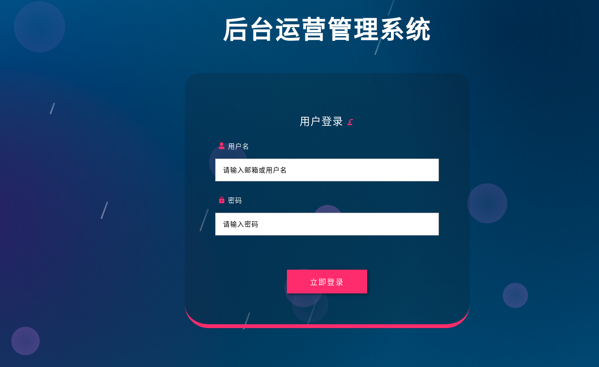
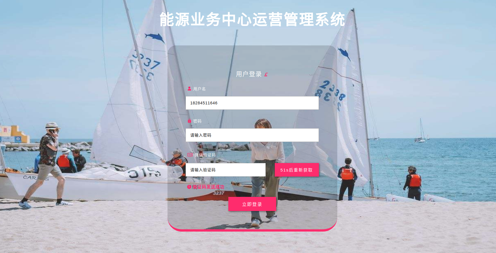

# login-with-up

> vue 用户登录组件

`引用login-with-up组件实现后台管理系统的登录功能`

√　更换背景图片;  
√　是否启用验证码登录;  
√　是否显示标签;  
√　登录消息提示;  
√　登录标签及提示自定义;  
√　实现发送验证码倒计时；  

## 1.组件引用

``` bash
npm install login-with-up --save
```

## 2.使用方法

#### 简单使用

``` js
<template>
  <div id="app">
    <login-with-up
      ref="LoginUp"
      :loginCallBack="login"
    >
    </login-with-up>
  </div>
</template>
```

``` js
<script>
  import loginWithUp from 'login-with-up'; // 引入
  export default {
    data () {
      return {}
    },
    components:{ //注册插件
      loginWithUp
    },
    methods:{
      login(e){
        //在这里获取数据进行登录
        console.log(e);
        //如果登录失败
        this.$refs.LoginUp.showError("用户名或密码错误")
      }
    }
  }
</script>
```

#### 图片预览
简单使用时插件使用默认数据



### 参数配置

| 参数           | 类型 | 可选值  |    默认值    | 　说明         | 
| ----------    | ------------ | :----: | :---: | :--------: | 
| loginCallBack  | function |    必   |     | 登录按钮回调  |
| bgImageUrl     | string |  　可  | 系统背景  | 登录背景图　| 
| systemName     | string   |  可  |  后台运营管理系统   | 系统名称     | 
| copyright      |  string  |  可  | 不传则不显示 | 版权信息　　  | 
| loginTitle     |   string  |  可   | 默认"用户登录" | 登录标题　   | 
| loginNameLabel |   string |  可   |  默认"用户名"    | 登录账号标签　 | 
| loginNameHolder | string |    可   |   默认"请输入邮箱或用户名"  | 登录账号框提示 |
| loginPwdLabel | string |    可   |  默认"密码"   | 登录密码标签  |　
| loginPwdHolder | string |    可   |   默认"请输入密码"  | 登录密码框提示|
| codeLabel  | string |    可   |  默认"验证码"   | 登录验证码标签 |　　
| codeHolder | string |    可   |  默认"请输入微信验证码" | 登录验证码提示 |
| sendBtnLabel| string |   可 | 默认"获取微信验证码"  | 获取验证码按钮文字 |
| requireCode | boolean |    可   | 默认 - false | 是否需要显示验证码验证|
| requireLabel | boolean |    可   |   默认 - true | 是否需要显示标签  |
| sendCode  | function |    可   |     | 发送验证码回调  |

``` js
<template>
  <div id="app">
    <login-with-up
      ref="LoginUp"
      :loginCallBack="login"
      :bgImageUrl="bgImageUrl"
      :systemName="systemName"
      :copyright="copyright"
      :loginTitle="loginTitle"
      :loginNameLabel:"loginNameLabel",
      :loginNameHolder:"loginNameHolder",
      :loginPwdLabel:"loginPwdLabel",
      :loginPwdHolder:"loginPwdHolder",
      :codeLabel:"codeLabel",
      :codeHolder:"codeHolder",
      :sendBtnLabel:"sendBtnLabel"
      :requireCode="true"
      :requireLabel="false"
      :sendCode="sendCode"
    >
    </login-with-up>
  </div>
</template>
```

``` js
<script>
  import loginWithUp from 'login-with-up'; // 引入
  export default {
    data () {
      return {
        bgImageUrl: "https://timgsa.baidu.com/timg?image&quality=80&size=b9999_10000&sec=1565240473656&di=d7802b33660d2ae5326216421348b0e5&imgtype=0&src=http%3A%2F%2Fg.hiphotos.baidu.com%2Fimage%2Fpic%2Fitem%2F5366d0160924ab18014cefd83bfae6cd7a890b82.jpg",
        systemName:"能源业务中心运营管理系统",
        copyright:"版权",
        loginTitle:"用户登录",
        loginNameLabel:"用户名",
        loginNameHolder:"请输入用户名",
        loginPwdLabel:"密码",
        loginPwdHolder:"请输入用户密码",
        codeLabel:"微信验证码",
        codeHolder:"请输入验证码",
        sendBtnLabel:"获取验证码"
      }
    },
    components:{ //注册插件
      loginWithUp
    },
    methods:{
      login(e){
        //在这里获取数据进行登录
        console.log(e);
        //如果登陆失败，发送错误信息
        this.$refs.LoginUp.showError("登录失败")
      },
      sendCode(e){
        this.$refs.LoginUp.showError("验证码发送成功")
        this.$refs.LoginUp.countDown("获取微信验证码")
      }
    }
  }
</script>
```

#### 图片预览


#### 错误消息提示

``` js
this.$refs.LoginUp.showError("登录失败")
```

#### 有验证码时接口成功后调用展示倒计时

``` js
this.$refs.LoginUp.countDown("获取微信验证码")
```
