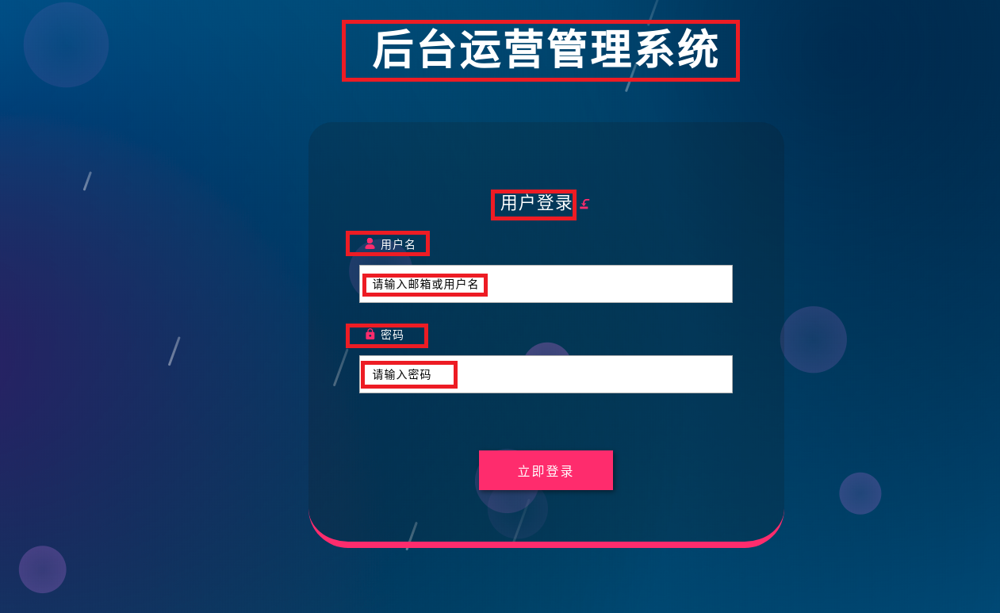
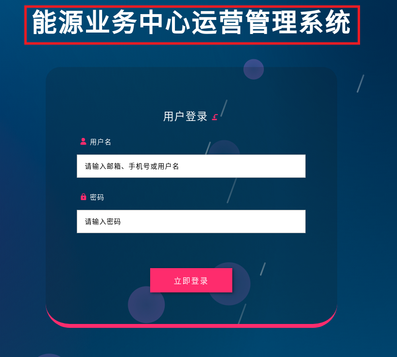
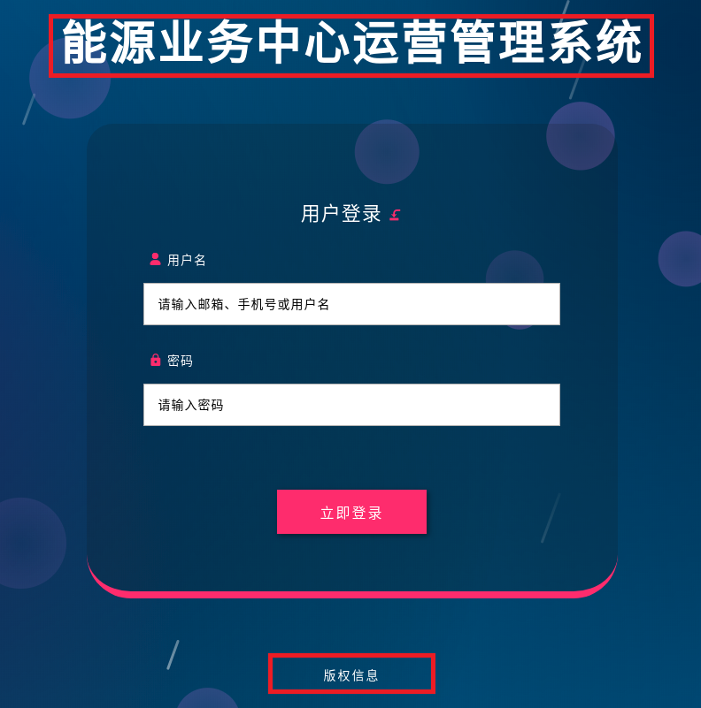
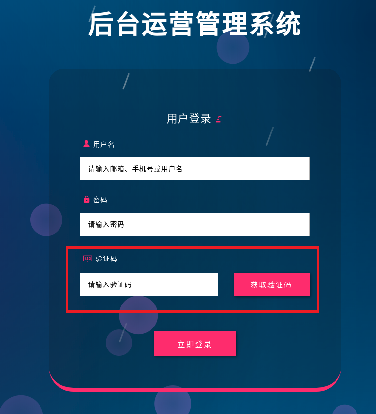
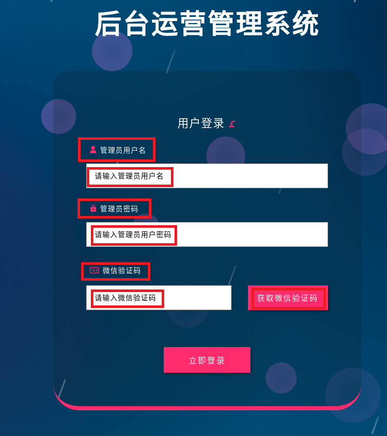
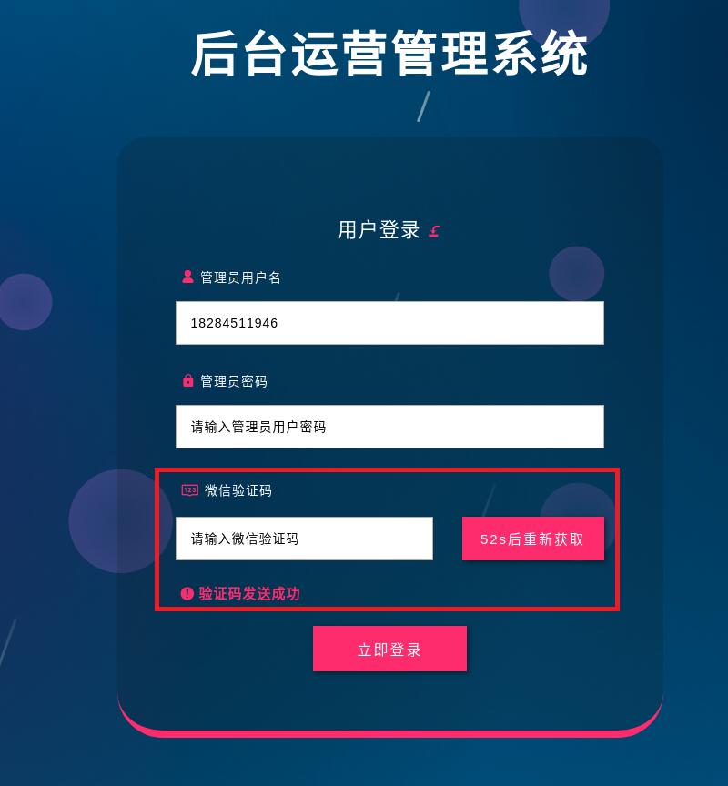

# login-with-up

> vue 用户登录组件

`引用login-with-up组件实现后台管理系统的登录功能，根据需求实现登录背景更换，登录标签的自定义及是否显示，及采用微信（短信）验证码的更安全方式验证等，使用简单，配置方便，简单易懂`

√　自定义更换背景图片或采用默认背景图;  
√　根据需求配置相关参数实现是否显示标签;  
√　根据需求自定义登录标签及相关提示;
√　提供登录消息提示（参数输入为空，登录失败）方法;  
√　为登录更加安全提供验证码登录（微信，短信）方式登录，配置为验证码验证登录时需配置相关标签;  
√　采用验证码方式登录里需要在接口成功时调用发送验证码倒计时方法（countDown（"获取微信验证码"））；  

## 组件引用

`使用组件时使用npm install引用`

``` bash
npm install login-with-up --save
```

`引用指定版本`

``` bash
npm install login-with-up@版本号
```

## 使用方法

### 1.简单使用

`使用时在vue中的<template></template>标签中加入引用的组件<login-with-up></login-with-up>及实现登录的回调方法loginCallBack`

``` js
<template>
  <div id="app">
    <login-with-up
      ref="LoginUp"
      :loginCallBack="login"　//登录回调
    >
    </login-with-up>
  </div>
</template>
```

``` js
<script>
  import loginWithUp from 'login-with-up'; // 引入组件
  export default {
    data () {
      return {}
    },
    components:{ //注册组件
      loginWithUp
    },
    methods:{
      login(e){
        //在这里获取数据进行登录
        if(true){
          //登录成功
          this.$router.push("/")　//跳转到成功页面
          return
        }
        //如果登录失败则提示错误信息
        this.$refs.LoginUp.showError("用户名或密码错误")
      }
    }
  }
</script>
```

> showError("用户名或密码错误") 登录消息提示方法，在登录参数验证及登录成功或失败时提示信息展示.使用方法如下：

``` js
this.$refs.LoginUp.showError("登录失败")
```

#### 图片预览

`组件简单使用时，引用组件，配置登录回调方法就可使用，其效果图如下：在简单使用时背景及红圏中的数据都采用默认值显示`



### 2.参数配置使用

#### 参数说明

| 参数           | 类型 | 可选值  |    默认值    | 　说明         | 
| :----------:   | :------------: |  :----:   | :---: | :--------: | 
| loginCallBack  | function |  必  |           | 登录按钮回调  |
| bgImageUrl     | string   |  可  | 系统背景    | 登录背景图　| 
| systemName     | string   |  可  | 后台运营管理系统 | 系统名称     | 
| copyright      | string   |  可  | 不传则不显示   | 版权信息　　  | 
| loginTitle     | string   |  可  | 默认"用户登录" | 登录标题　   | 
| loginNameLabel | string   |  可  | 默认"用户名"   | 登录账号标签　 | 
| loginNameHolder| string   |  可  | 默认"请输入邮箱或用户名"  | 登录账号框提示 |
| loginPwdLabel  | string   |  可  | 默认"密码"       | 登录密码标签  |　
| loginPwdHolder | string   |  可  | 默认"请输入密码"  | 登录密码框提示 |
| codeLabel      | string   |  可  | 默认"验证码"      | 登录验证码标签 |　　
| codeHolder     | string   |  可  | 默认"请输入验证码" | 登录验证码提示 |
| sendBtnLabel   | string   |  可  | 默认"获取验证码"   | 获取验证码按钮文字 |
| requireCode    | boolean  |  可  | 默认 - false      | 是否需要显示验证码验证 |
| requireLabel   | boolean  |  可  | 默认 - true       | 是否需要显示标签  |
| sendCode       | function |  可  |                  | 发送验证码回调  |

`使用时在vue中的<template></template>标签中加入引用的组件<login-with-up></login-with-up>及实现登录的回调方法loginCallBack及自定义各个元素数据及可实现相应效果`

#### 完整实例

``` js
<template>
  <div id="app">
    <login-with-up
      ref="LoginUp"
      :loginCallBack="login"
      :bgImageUrl="bgImageUrl"
      :systemName="systemName"
      :copyright="copyright"
      :loginTitle="loginTitle"
      :loginNameLabel="loginNameLabel",
      :loginNameHolder="loginNameHolder",
      :loginPwdLabel="loginPwdLabel",
      :loginPwdHolder="loginPwdHolder",
      :codeLabel="codeLabel",
      :codeHolder="codeHolder",
      :sendBtnLabel="sendBtnLabel"
      :requireCode="true"
      :requireLabel="false"
      :sendCode="sendCode"
    >
    </login-with-up>
  </div>
</template>
```

``` js
<script>
  import loginWithUp from 'login-with-up'; // 引入
  export default {
    data () {
      return {
        bgImageUrl: "https://timgsa.baidu.com/timg?image&quality=80&size=b9999_10000&sec=1565240473656&di=d7802b33660d2ae5326216421348b0e5&imgtype=0&src=http%3A%2F%2Fg.hiphotos.baidu.com%2Fimage%2Fpic%2Fitem%2F5366d0160924ab18014cefd83bfae6cd7a890b82.jpg",
        systemName:"能源业务中心运营管理系统",
        copyright:"版权",
        loginTitle:"用户登录",
        loginNameLabel:"用户名",
        loginNameHolder:"请输入用户名",
        loginPwdLabel:"密码",
        loginPwdHolder:"请输入用户密码",
        codeLabel:"微信验证码",
        codeHolder:"请输入验证码",
        sendBtnLabel:"获取验证码"
      }
    },
    components:{ //注册插件
      loginWithUp
    },
    methods:{
      login(e){
        //在这里获取数据进行登录
        if(true){
          //登录成功
          this.$router.push("/")　//跳转到成功页面
          return
        }
        //如果登陆失败，发送错误信息
        this.$refs.LoginUp.showError("登录失败")
      },
      sendCode(e){
        this.$refs.LoginUp.showError("验证码发送成功")　//验证发送成功提示
        this.$refs.LoginUp.countDown("获取微信验证码")　//调用倒计时方法，实现倒计时功能
      }
    }
  }
</script>
```

> countDown("获取微信验证码") 倒计时方法.使用方法如下：

``` js
this.$refs.LoginUp.countDown("获取微信验证码")
```

#### 图片预览

`组件通过参数配置使用时，引用组件，配置登录回调方法及相关配置参数，其效果图如下：`

|   图1-1 |  图1-2   |  图1-3  |  图1-4  |  　图1-5 |  图1-6  |
| :-----: | :-----: | :-----: | :-----: | :-----: | :-----: | 
|   |  |    |      |   |  |

`图1-1 单独配置了systemName（系统名称）`
`图1-2 单独配置了systemName（系统名称）和copyright(版权信息)`
`图1-3 配置了requireCode（是否需求验证码）`
`图1-4 配置了登录标签与提示`
`图1-5 配置了是否需要显示标签`
`图1-6 调用倒计时效果`
